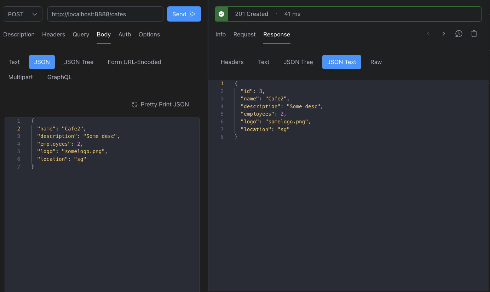
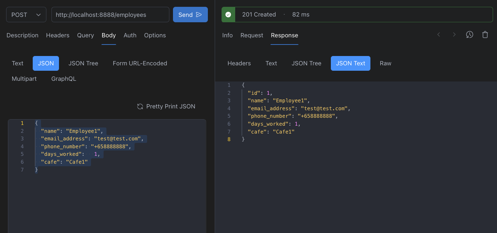

[Nest](https://github.com/nestjs/nest) framework TypeScript starter repository.

## Installation

```bash
$ pnpm install
```

## Running the app

```bash
# development
$ pnpm run start

# watch mode
$ pnpm run start:dev

# production mode
$ pnpm run start:prod
```

## Test

```bash
# unit tests
$ pnpm run test

# e2e tests
$ pnpm run test:e2e

# test coverage
$ pnpm run test:cov
```
 
##
Use Prisma CLI to apply migrations and generate the Prisma client:

```bash
npx prisma migrate dev
npx prisma generate

```

## API

Default service api url
http://location:8888

> CRUD Operations:
### Employees

* READ: /employees (GET)
* READ: /employees/:id (GET)
* CREATE: /employees (POST)
* UPDATE: /employees/:id (PATCH)
* DELETE: /employees/:id (DELETE)

### Cafes

* READ: /cafes (GET)
* READ: /cafes/:id (GET)
* CREATE: /cafes (POST)
* UPDATE: /cafes/:id (PATCH)
* DELETE: /cafes/:id (DELETE)

### Sample

**Create Cafes**

Request:
```json
{
  "name": "Cafe2",
  "description": "Some desc",
  "employees": 2,
  "logo": "somelogo.png",
  "location": "sg"
}

```

Response
```json
{
  "id": 3,
  "name": "Cafe2",
  "description": "Some desc",
  "employees": 2,
  "logo": "somelogo.png",
  "location": "sg"
}
```
----
**Create Employees**


Request:
```json
{
  "name": "Employee1",
  "email_address": "test@test.com",
  "phone_number": "+658888888",
  "days_worked":   1,
  "cafe": "Cafe1"
}

```

Response
```json
{
  "id": 1,
  "name": "Employee1",
  "email_address": "test@test.com",
  "phone_number": "+658888888",
  "days_worked": 1,
  "cafe": "Cafe1"
}
```


## License

Nest is [MIT licensed](LICENSE).
